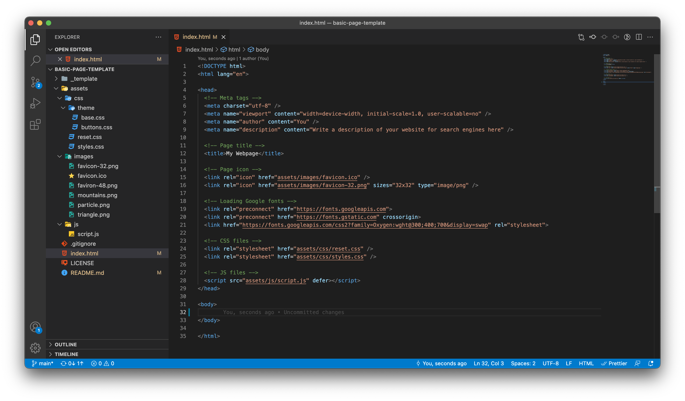
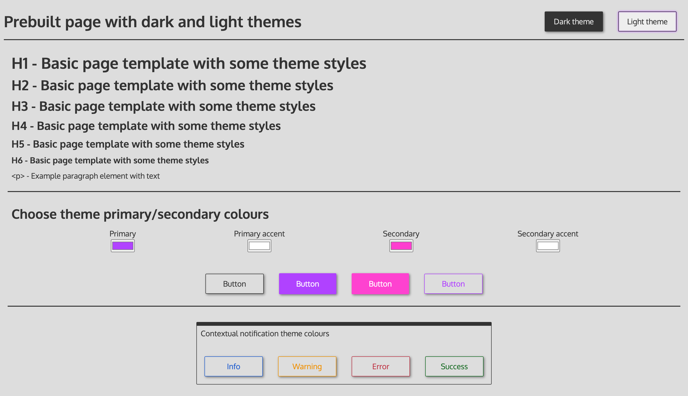

# Web page starter template repo

A simple for starting a standalone web page

## Contents
- [Features](#features)
- [Usage](#usage)
- [File Structure](#file-structure)
- [CSS Themes](#css-themes)  
  
<br />  
  
  
## Features

- 📉 HTML boilerplate `index.html` file with resources linked.
- 🎨 CSS
  - ⏪ Simple `reset.css` file for standardising cross-browser.
  - 🎓 Sensible defaults in `styles.css`.
- 👷‍♀️ Prebuilt CSS theme with
  - 🌙 Dark and 🌞 Light modes
  - ℹ️ Contextual colours
  - 🔘 Prebuilt button styles
  - 🃏 Demo page
- 🖥️ JS `script.js` file.
- 🔠 Oxygen google font as default.
- 😎 Placeholder favicon.
- 🌄 3 free-to-use image assets.  
  
<br />  

## Usage

When starting a new project, delete the `_template` folder. It is used to hold meta files for this README and the CSS theme demonstration files.

You can also delete any of the files under `assets/images` that you aren't using, and the files under `assets/css/theme` if you're not using the built-in theme.  
  
<br />  

## File structure

Project follows a clean standard for a standalone web page. See screenshot below for an example of the folder structure.
  
  
<br />  

## CSS Themes

Project now has built-in dark and light themes. To see a demonstration of them in action, have a look at the page found under `_template/demo.html`  

### Usage

To use the built-in themes, include the `base.css` file found in `assets/css/theme`.

```html
<link rel="stylesheet" href="assets/css/theme/base.css" />
```

To use prebuilt button styles, also include `assets/css/theme/buttons.css`. This must come after `main.css` in the stylesheet order.

```html
<link rel="stylesheet" href="assets/css/theme/buttons.css" />
```  
  
### Dark Theme

  

### Light Theme

  
  
<br />  

Made with 🫀 by Ben
©️2021